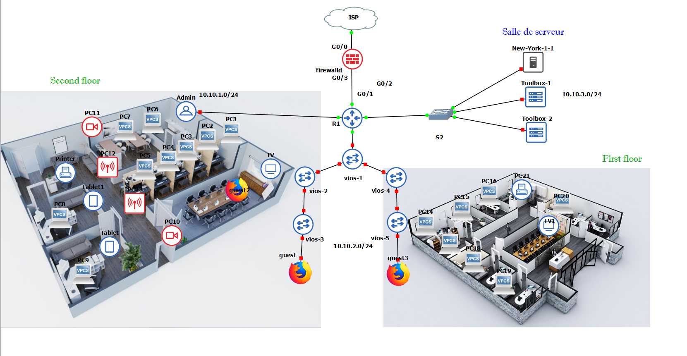
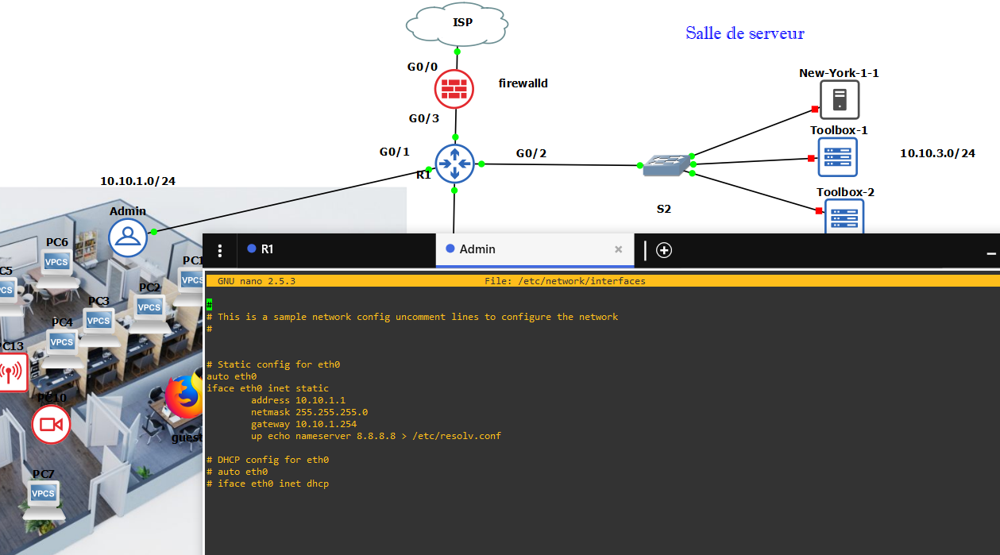
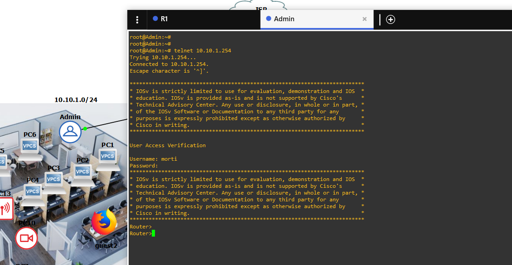
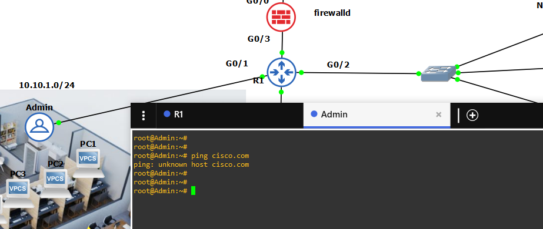
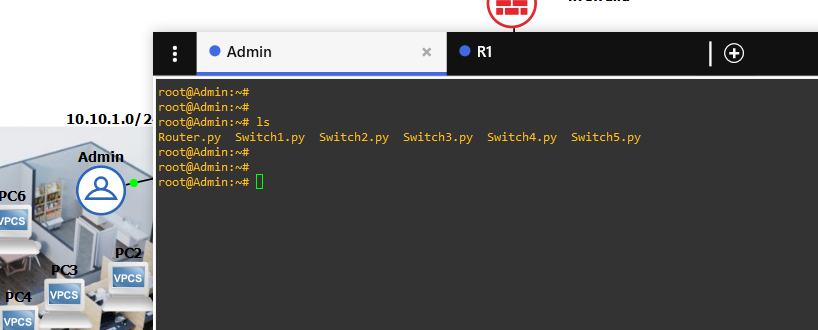
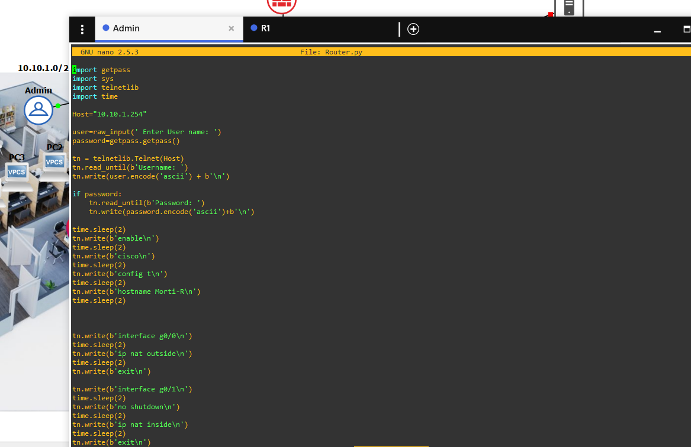

# Python-Automation
How to configure our network using python scripts.


:star: in this topology, we have a 2 floor appartment with different components, we are going to configure our instruments using python scripts. 
##



##

##
:star: First let's our Admin's IP address: 

```
nano /etc/network/interfaces
```

##

##

##
:star: Now let's check connectivity between this computer and the router using : 

```
telnet 10.10.1.254
```

##

##

##
:star: Now let's check connectivity between this computer and the internet : 

```
ping cisco.com
```

##

##

 


:star: Step 1: Router configuration 

As you can see there's no connection between our inside local network and the internet. so we are using this python script to configure our router, to create several sub-interfaces on the router and tell it to which VLAN they belong to, to create the DHCP pool for these VLANs and to configure NAT, so our users could have access to the internet.
##
:star: You can see all scripts that we'r going to use for this project usins:

##
``
ls
``
##

##

##
##

And the script ' router.py` is the only script that we'll use to configure our router using the following command: 

```
python Router.py    
```
```
(python + our script's name)
```

``` python 

import getpass
import sys
import telnetlib
import time

Host="10.10.1.254"

user=raw_input(' Enter User name: ')
password=getpass.getpass()

tn = telnetlib.Telnet(Host)
tn.read_until(b'Username: ')
tn.write(user.encode('ascii') + b'\n')

if password:
    tn.read_until(b'Password: ')
    tn.write(password.encode('ascii')+b'\n')

time.sleep(2)
tn.write(b'enable\n')
time.sleep(2)
tn.write(b'cisco\n')
time.sleep(2)
tn.write(b'config t\n')
time.sleep(2)
tn.write(b'hostname Morti-R\n')
time.sleep(2)


tn.write(b'interface g0/0\n')
time.sleep(2)
tn.write(b'ip nat outside\n')
time.sleep(2)
tn.write(b'exit\n')

tn.write(b'interface g0/1\n')
time.sleep(2)
tn.write(b'no shutdown\n')
time.sleep(2)
tn.write(b'ip nat inside\n')
time.sleep(2)
tn.write(b'exit\n')

tn.write(b'interface g0/1.10\n')
time.sleep(2)
tn.write(b'encapsulation dot1Q 10\n')
time.sleep(2)
tn.write(b'ip address 192.168.10.254 255.255.255.0\n')
time.sleep(2)
tn.write(b'ip nat inside\n')
time.sleep(2)
tn.write(b'no shutdown\n')
time.sleep(2)
tn.write(b'exit\n')

tn.write(b'interface g0/1.20\n')
time.sleep(2)
tn.write(b'encapsulation dot1Q 20\n')
time.sleep(2)
tn.write(b'ip address 192.168.20.254 255.255.255.0\n')
time.sleep(2)
tn.write(b'ip nat inside\n')
time.sleep(2)
tn.write(b'no shutdown\n')
time.sleep(2)
tn.write(b'exit\n')

tn.write(b'interface g0/1.30\n')
time.sleep(2)
tn.write(b'encapsulation dot1Q 30\n')
time.sleep(2)
tn.write(b'ip address 192.168.30.254 255.255.255.0\n')
time.sleep(2)
tn.write(b'ip nat inside\n')
time.sleep(2)
tn.write(b'no shutdown\n')
time.sleep(2)
tn.write(b'exit\n')

tn.write(b'interface g0/1.40\n')
time.sleep(2)
tn.write(b'encapsulation dot1Q 40\n')
time.sleep(2)
tn.write(b'ip address 192.168.40.254 255.255.255.0\n')
time.sleep(2)
tn.write(b'ip nat inside\n')
time.sleep(2)
tn.write(b'no shutdown\n')
time.sleep(2)
tn.write(b'exit\n')

tn.write(b'interface g0/1.50\n')
time.sleep(2)
tn.write(b'encapsulation dot1Q 50\n')
time.sleep(2)
tn.write(b'ip address 192.168.50.254 255.255.255.0\n')
time.sleep(2)
tn.write(b'ip nat inside\n')
time.sleep(2)
tn.write(b'no shutdown\n')
time.sleep(2)

tn.write(b'interface g0/3\n')
time.sleep(2)
tn.write(b'ip nat inside\n')
time.sleep(2)
tn.write(b'exit\n')

tn.write(b'interface g0/2\n')
time.sleep(2)
tn.write(b'ip nat inside\n')
time.sleep(2)
tn.write(b'exit\n')

tn.write(b'access-list 1 permit any\n')
time.sleep(2)
tn.write(b'ip nat inside source list 1 interface g0/0 overload\n')
time.sleep(2)
tn.write(b'ip domain lookup\n')
time.sleep(2)
tn.write(b'ip name-server 192.168.122.1\n')
time.sleep(2)

tn.write(b'ip dhcp pool servers\n')
time.sleep(2)
tn.write(b'network 10.10.3.0 255.255.255.0\n')
time.sleep(2)
tn.write(b'default-router 10.10.3.254\n')
time.sleep(2)
tn.write(b'dns-server 8.8.8.8\n')
time.sleep(2)
tn.write(b'exit\n')

tn.write(b'ip dhcp pool guest\n')
time.sleep(2)
tn.write(b'network 192.168.10.0 255.255.255.0\n')
time.sleep(2)
tn.write(b'default-router 192.168.10.254\n')
time.sleep(2)
tn.write(b'dns-server 8.8.8.8\n')
tn.write(b'exit\n')

tn.write(b'ip dhcp pool users\n')
time.sleep(2)
tn.write(b'network 192.168.20.0 255.255.255.0\n')
time.sleep(2)
tn.write(b'default-router 192.168.20.254\n')
time.sleep(2)
tn.write(b'dns-server 8.8.8.8\n')
tn.write(b'exit\n')

tn.write(b'ip dhcp pool users\n')
time.sleep(2)
tn.write(b'network 192.168.20.0 255.255.255.0\n')
time.sleep(2)
tn.write(b'default-router 192.168.20.254\n')
time.sleep(2)
tn.write(b'dns-server 8.8.8.8\n')
tn.write(b'exit\n')

tn.write(b'ip dhcp pool HS\n')
time.sleep(2)
tn.write(b'network 192.168.30.0 255.255.255.0\n')
time.sleep(2)
tn.write(b'default-router 192.168.30.254\n')
time.sleep(2)
tn.write(b'dns-server 8.8.8.8\n')
time.sleep(2)
tn.write(b'exit\n')

tn.write(b'end\n')
tn.write(b'exit\n')
line=tn.read_all()
print (line)

```

Let's check this script first in our computer using: 

```
nano Router.py

```
##

##
